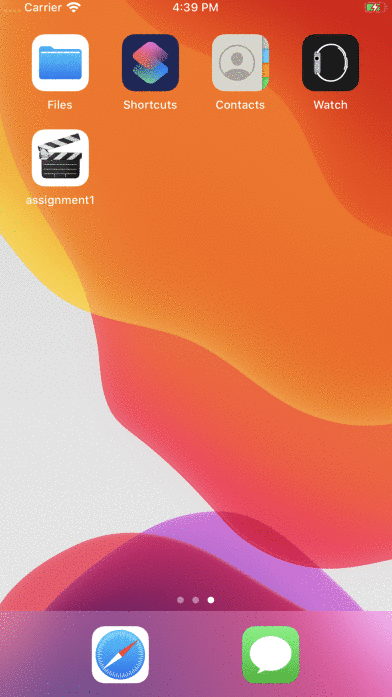

# Flix

Flix is an app that allows users to browse movies from the [The Movie Database API](http://docs.themoviedb.apiary.io/#).

## Flix Part 2

### User Stories

#### REQUIRED (10pts)
- [X] (5pts) User can tap a cell to see more details about a particular movie.
- [X] (5pts) User can tap a tab bar button to view a grid layout of Movie Posters using a CollectionView.

#### BONUS
- [X] (2pts) User can tap a poster in the collection view to see a detail screen of that movie.
- [X] (2pts) In the detail view, when the user taps the poster, a new screen is presented modally where they can view the trailer.

### App Walkthough GIF
 

---

## Flix Part 1

### User Stories

#### REQUIRED (10pts)
- [X] (2pts) User sees an app icon on the home screen and a styled launch screen.
- [X] (5pts) User can view and scroll through a list of movies now playing in theaters.
- [X] (3pts) User can view the movie poster image for each movie.

#### BONUS
- [X] (2pt) User can view the app on various device sizes and orientations.
- [X] (1pt) Run your app on a real device.

### App Walkthough GIF
 

### Notes
**Objectives Learned :**
* Creating a Network Request to an API:
  * Copying a chunk of code... should try to understand better what that chunk  actually means
* Creating UITableViews: 
  * Still don't understand the purpose of UITableViewDataSource and UITableViewDelegate.
* Creating custom UITableCells:
  * Pretty straight forward by creating a new Cocoa Touch Class.
* Adding Pods to the project and using AlmaofireImage
